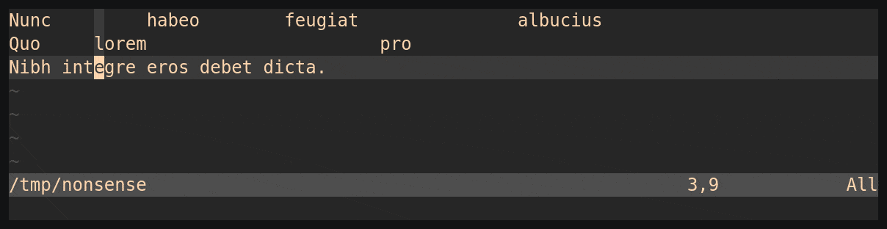
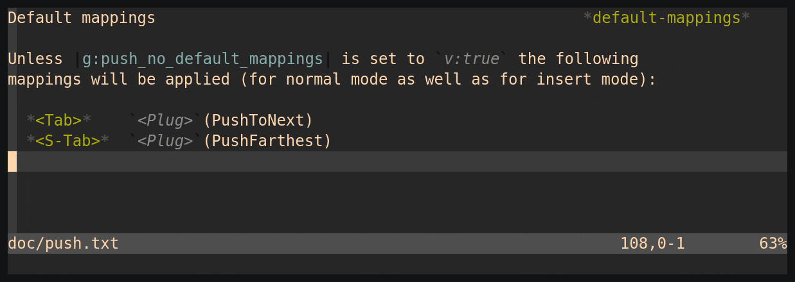
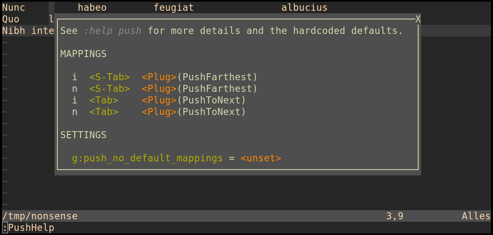

push.vim
========

Introduction
------------

*push.vim* is a plugin to push text in the current line to a "push stop" in a
line above the current one (called a reference line).
Its purpose is to align text with the text in some line above.

Depending on the actual function a "push stop" may either be the beginning of
a word or the end of the last word of a line.

To find a "push stop" this plugin looks in the lines above the current one
until it finds a push stop that is further to the right than the cursor (or
the start of the current word, respectively).


Mappings
--------

All mappings exist for normal mode and insert mode.
They differ slightly in that the normal mode mappings push whole words
around, while the insert mode mappings always push from the current
cursor position, even if the cursor is inside a word.

All the mappings have support for [tpope/repeat.vim] and are therefore
repeatable with the dot command.

  - `<Plug>(PushToNext)`

    Push the current word (in normal mode) or the cursor (in insert mode)
    to the next push stop.

    Example:

    ```
      Nunc         habeo        feugiat               albucius
      Quo     lorem                      pro
      Nibh integre eros debet dicta.
    ```

    If the cursor is on the word 'integre' at the last line, calling
    `<Plug>(PushToNext)` in normal mode aligns it with the next word in the
    line above, 'lorem'.

    ```
      Nunc         habeo        feugiat               albucius
      Quo     lorem                      pro
      Nibh    integre eros debet dicta.
    ```

    Calling it a second time aligns it with the next word in the line above,
    'pro'.

    ```
      Nunc         habeo        feugiat               albucius
      Quo     lorem                      pro
      Nibh                               integre eros debet dicta.
    ```

    Calling it a third time will align it with the next word two lines
    above, 'albucius', as the line directly above does not contain any more
    push stops.

    ```
      Nunc         habeo        feugiat               albucius
      Quo     lorem                      pro
      Nibh                                            integre eros debet dicta.
    ```

    Push to Next in normal mode:
    

    Push to Next in insert mode:
    


  - `<Plug>(PushFarthest)`

    Push the content of the line from the current word (in normal mode)
    or the cursor (in insert mode) to right align with a reference line
    above.

    Example:
    ```
      <Plug>(MyPlugMap)                                       *my-plug-map*
      <Plug>(OtherPlugMap) *other-plug-map*
    ```

    If the cursor is on the word \*other-plug-map* in the second line,
    calling `<Plug>(PushFarthest)` will push the word to right align with
    the line above.

    ```
      <Plug>(MyPlugMap)                                       *my-plug-map*
      <Plug>(OtherPlugMap)                                 *other-plug-map*
    ```

    Push Farthest:
    


### Default mappings

Unless `g:push_no_default_mappings` is set to `v:true` the following
mappings will be applied (for normal mode as well as for insert mode):

  - `<Tab>`:    `<Plug>(PushToNext)`

  - `<S-Tab>`:  `<Plug>(PushFarthest)`


Commands
--------

  - `:PushHelp`

    Open a help window displaying the current key mappings and settings
    of push.vim

    If [skywind3000/vim-quickui] is available the help content will be
    shown in a popup dialog. Otherwise a normal split window will be
    used.
    The split window can be closed with either `q` or `gq`.

    Help window with `vim-quickui`:
    


Settings
--------

- `g:push_no_default_mappings`

  Set to `v:true` to to avoid the default-mappings.


Complementary plugins
---------------------

  - [tpope/vim-repeat]

    To support repeating push mappings with the dot command, vim-repeat needs
    to be installed.

  - [skywind3000/vim-quickui]

    To display the help window in a floating window, vim-quickui needs to be
    installed.


License
-------

This plugin is licensed under the terms of the MIT License.

http://opensource.org/licenses/MIT


[tpope/vim-repeat]: https://github.com/tpope/vim-repeat
[skywind3000/vim-quickui]: https://github.com/skywind3000/vim-quickui
